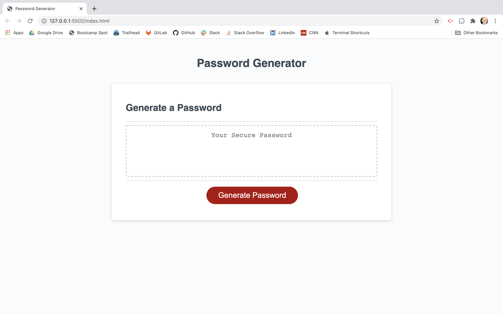

# Password Generator #

[Features](#features)\
[How to Use](#How-to-use)

I built this simple but effective password generator to allow the user to fully customize what characters they want to use in their randomized password. This addresses the issue of certain websites requiring specific characters but not allowing certain characters. With this generator, you can select if you want lower case letters, upper case letters, numbers, and special characters. This makes it much more functional for someone that needs to make their password fit a certain criteria. 

---
## Features ##

* Customizable password length
* Versatile letter options
* Generates a fully randomized password matching the criteria the user has selected

[Quick link to the deployed application on GitHub Pages](https://zacharybryan.github.io/js-password-generator/)

### How to Use ###

1. When you're ready to generate your password, click the "Generate Password" button
1. Follow the given prompts to choose what you'd like included in your password
1. Copy your newly generated password and enjoy!

---
Copyright (c) 2020 Bryan, Zachary

Permission is hereby granted, free of charge, to any person obtaining a copy
of this software and associated documentation files (the "Software"), to deal
in the Software without restriction, including without limitation the rights
to use, copy, modify, merge, publish, distribute, sublicense, and/or sell
copies of the Software, and to permit persons to whom the Software is
furnished to do so, subject to the following conditions:

The above copyright notice and this permission notice shall be included in all
copies or substantial portions of the Software.

THE SOFTWARE IS PROVIDED "AS IS", WITHOUT WARRANTY OF ANY KIND, EXPRESS OR
IMPLIED, INCLUDING BUT NOT LIMITED TO THE WARRANTIES OF MERCHANTABILITY,
FITNESS FOR A PARTICULAR PURPOSE AND NONINFRINGEMENT. IN NO EVENT SHALL THE
AUTHORS OR COPYRIGHT HOLDERS BE LIABLE FOR ANY CLAIM, DAMAGES OR OTHER
LIABILITY, WHETHER IN AN ACTION OF CONTRACT, TORT OR OTHERWISE, ARISING FROM,
OUT OF OR IN CONNECTION WITH THE SOFTWARE OR THE USE OR OTHER DEALINGS IN THE
SOFTWARE.

